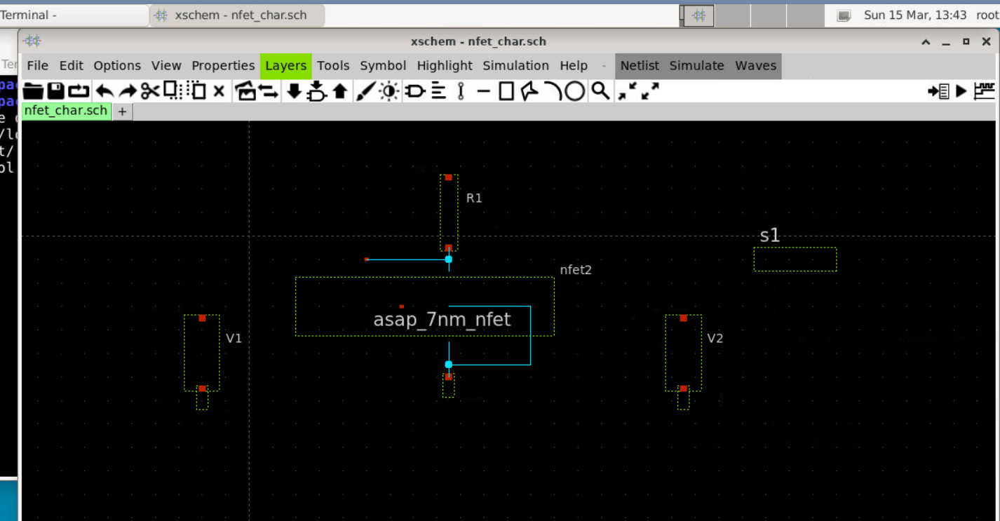
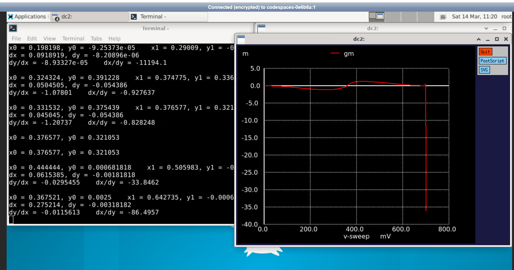
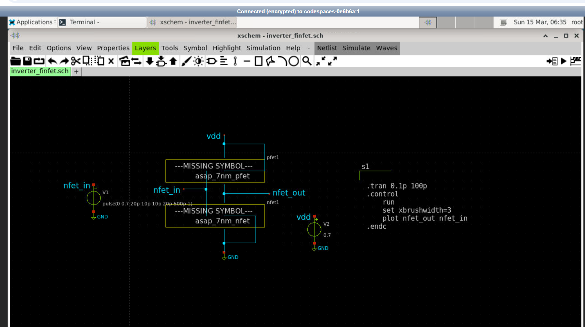
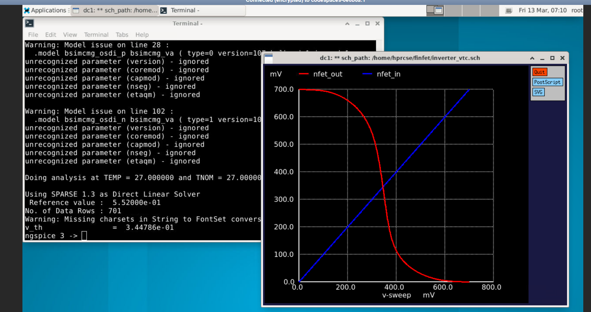
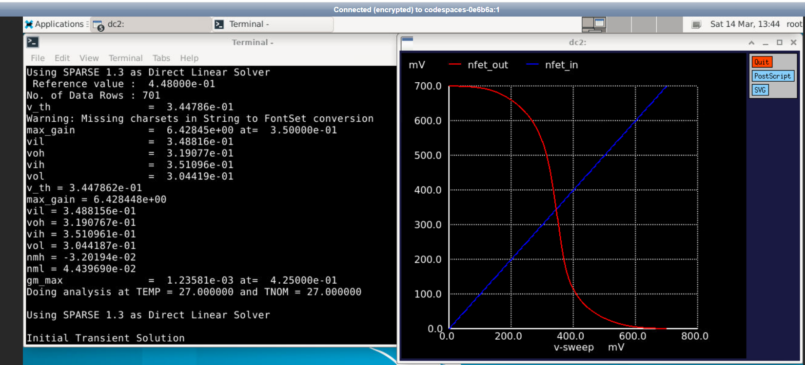
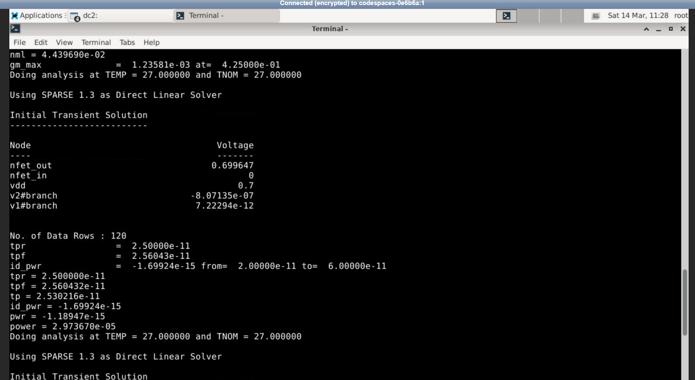
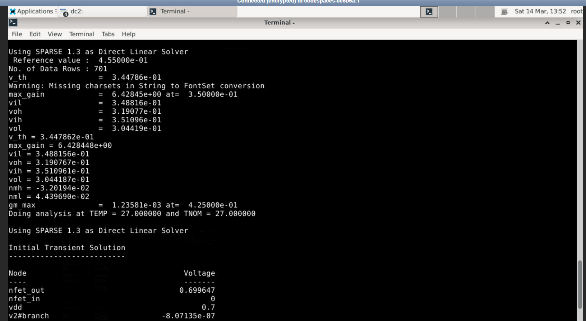
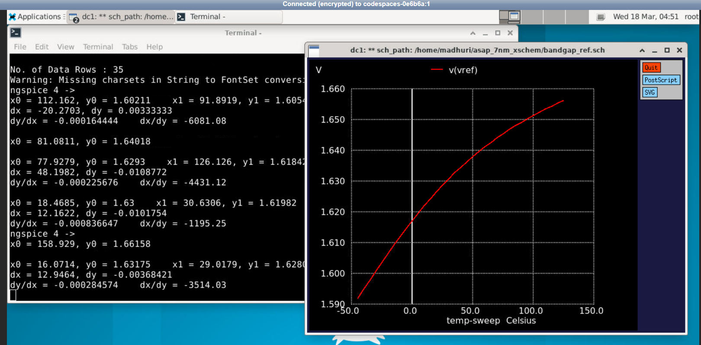
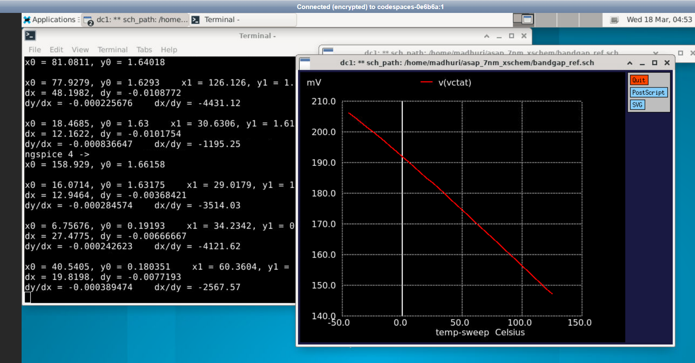
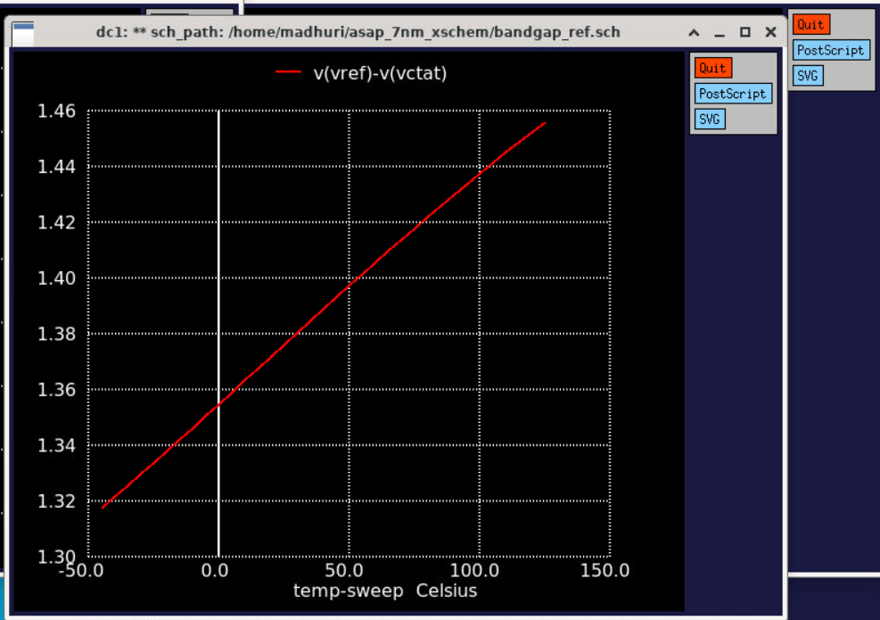

# 7nm FinFET Device and Circuit Characterization


> Complete characterization of 7nm FinFET devices and analog circuits using the **ASAP7 Predictive PDK** with BSIM-CMG models. Covers device DC characterization, CMOS digital cell analysis, and analog bandgap reference design — simulated using open-source EDA tools Xschem and Ngspice.

---

## Table of Contents

- [Overview](#overview)
- [Technology and Tools](#technology-and-tools)
- [Repository Structure](#repository-structure)
- [Part 1 — NFET Device Characterization](#part-1--nfet-device-characterization)
- [Part 2 — FinFET CMOS Inverter Characterization](#part-2--finfet-cmos-inverter-characterization)
- [Part 3 — 7nm Bandgap Reference Circuit](#part-3--7nm-bandgap-reference-circuit)
- [Key Results Summary](#key-results-summary)
- [Skills Demonstrated](#skills-demonstrated)
- [How to Reproduce](#how-to-reproduce)
- [Acknowledgements](#acknowledgements)

---

## Overview

This project presents a complete characterization flow for 7nm FinFET technology — from individual transistor device physics to full analog circuit simulation. All work uses the **ASAP7 Predictive PDK** (Arizona State University) with BSIM-CMG FinFET models on open-source EDA tools.

Three design problems are addressed:

1. **NFET DC Characterization** — device parameter extraction (Id-Vgs, Id-Vds, gm, ro)
2. **CMOS Inverter Analysis** — VTC, noise margins, propagation delay, and power
3. **Bandgap Reference Design** — CTAT/PTAT compensation and temperature-stable Vref

**Technology:** ASAP7 7nm Predictive PDK — BSIM-CMG FinFET Models  
**Environment:** Ubuntu 22.04 Linux

---

## Technology and Tools

| Tool | Version | Purpose |
|---|---|---|
| Ngspice | 45+ | SPICE circuit simulation |
| Xschem | 3.4.8 | Schematic capture and netlist generation |
| ASAP7 PDK | — | 7nm predictive FinFET device models (BSIM-CMG) |

---

## Repository Structure

```
7NM-FINFET/
│
├── bandgap/
│   ├── netlist/
│   │   ├── bandgap.sch
│   │   └── bandgap.spice
│   └── plots/
│       ├── bandgap_circuit_diagram.png
│       ├── bandgap_iptat_vs_temp.png
│       ├── bandgap_schematic.png
│       ├── bandgap_vctat_vs_temp.png
│       ├── bandgap_vptat_vs_temp.png
│       └── bandgap_vref_vs_temp.png
│
├── device/
│   ├── netlist/
│   │   ├── nfet_char.sch
│   │   └── nfet_char.spice
│   ├── plots/
│   │   ├── gm_plot.png
│   │   └── r_out_plot.png
│   ├── nfet_char_schematic.png
│   ├── nfet_id_curve.png
│   ├── nfet_id_vds.png
│   └── nfet_schematic.png
│
├── inverter/
│   ├── netlist/
│   │   ├── inverter_finfet.sch
│   │   ├── inverter_finfet.spice
│   │   ├── inverter_vtc.sch
│   │   ├── inverter_vtc.spice
│   │   └── inverter_vtc2.spice
│   └── plots/
│       ├── inverter_delay_power.png
│       ├── inverter_parameters.png
│       ├── inverter_parameters_nfin28.png
│       ├── inverter_schematic.png
│       ├── inverter_vtc.png
│       └── inverter_vtc_parameters.png
│
├── variation/
├── results/
├── scripts/
├── DIFFERENCES_FROM_VSD.md
├── RESULTS_SUMMARY.md
└── README.md
```

---

## Part 1 — NFET Device Characterization

### Objective

Characterize the fundamental DC behavior of a 7nm NFET FinFET device using ASAP7 BSIM-CMG models. Extract drain current characteristics, transconductance, and output resistance to validate device operating points and understand FinFET scaling behavior.

**Device Under Test:** `asap_7nm_nfet` | L = 7nm | nfin = 14

### Testbench Schematic



### Id vs Vds — Family of Curves

Drain current swept across Vds with Vgs stepped as a parameter, capturing both the linear and saturation regions.


### Id vs Vgs — Transfer Characteristic


### Transconductance (gm)

Transconductance extracted as `gm = dId/dVgs` at constant Vds. Peak gm indicates the bias point of maximum current efficiency.



### Output Resistance (ro)

Output resistance extracted as `ro = dVds/dId` at constant Vgs. High ro indicates effective channel length modulation suppression at 7nm.


### Fin Count Scaling Study

Fin count (nfin) directly controls effective transistor width in a FinFET without changing gate length.

| nfin | Drive Current | Transconductance gm | Threshold Voltage Vth |
|---|---|---|---|
| 14 | Baseline | Baseline | ~0.344 V |
| 16 | Slight increase | Slight increase | ~0.344 V |
| 28 | Higher | Higher | ~0.344 V |

**Observation:** Increasing nfin scales drive current and gm proportionally while Vth remains constant — consistent with FinFET multi-fin behavior. Since NMOS and PMOS scale symmetrically, the inverter switching threshold is unaffected by fin count changes.

---

## Part 2 — FinFET CMOS Inverter Characterization

### Objective

Design and fully characterize a minimum-geometry 7nm FinFET CMOS inverter. Extract the complete Voltage Transfer Characteristic, noise margins, propagation delay, and power consumption.

### Inverter Schematic



### Voltage Transfer Characteristic (VTC)

VTC extracted using a DC sweep of the input from 0 V to VDD, capturing the full logic transition, gain region, and logic-level boundaries.



### VTC with Extracted Parameters



### Extracted DC Parameters

| Parameter | Symbol | Value |
|---|---|---|
| Switching Threshold | Vth | 0.344 V |
| Maximum Voltage Gain | Av | 6.428 |
| Input Low Voltage | VIL | 0.348 V |
| Input High Voltage | VIH | 0.351 V |
| Output High Voltage | VOH | 0.319 V |
| Output Low Voltage | VOL | 0.304 V |
| Noise Margin High | NMH | −0.032 V |
| Noise Margin Low | NML | 0.044 V |
| Peak Transconductance | gm_max | 1.235 × 10⁻³ S |

> **Note:** The slightly negative NMH reflects compressed supply headroom at 7nm operating voltage — characteristic of minimum-geometry 7nm FinFET cells operating at reduced VDD.

### Propagation Delay and Power

Transient simulation with a square wave input used to extract rise/fall propagation delays and average power.



| Parameter | Value |
|---|---|
| Rise Propagation Delay (tpr) | 25.0 ps |
| Fall Propagation Delay (tpf) | 25.6 ps |
| Average Propagation Delay (tp) | 25.3 ps |
| Average Power | 2.97 × 10⁻⁵ W |

### nfin = 28 Scaled Inverter



### Terminal Parameter Extraction


---

## Part 3 — 7nm Bandgap Reference Circuit

### Objective

Simulate a Self-Cascode MOS Bandgap Reference in 7nm FinFET technology. Demonstrate CTAT/PTAT compensation and characterize output reference voltage stability across a wide industrial temperature range.

**Supply Voltage:** VDD = 1.75 V  
**Temperature Range:** −45 °C to +125 °C

### Circuit Topology

The self-cascode MOS configuration generates three signals that together produce a temperature-stable reference:

| Signal | Behavior | Role |
|---|---|---|
| Vctat | Decreases with temperature | CTAT component |
| Vptat | Increases with temperature | PTAT component |
| Vref | Near-constant with temperature | Stable voltage reference output |


### Schematic


### Vref vs Temperature

Near-flat reference voltage across the full temperature range, confirming effective CTAT/PTAT cancellation.



### Vctat vs Temperature

Monotonically decreasing behavior from gate-referred threshold voltage thermal dependence.



### PTAT Voltage vs Temperature

Linear increase with temperature generated by differential current mirroring within the self-cascode topology.



### PTAT Current vs Temperature

Temperature-proportional current confirming correct PTAT generator operation.


---

## Key Results Summary

| Parameter | Value |
|---|---|
| NFET Threshold Voltage | ~0.35 V |
| Inverter Switching Threshold | 0.344 V |
| Maximum Inverter Gain | 6.428 |
| Rise Propagation Delay | 25.0 ps |
| Fall Propagation Delay | 25.6 ps |
| Power Consumption | 2.97 × 10⁻⁵ W |
| Bandgap Reference Vref | ~1.6 V |
| Temperature Range Tested | −45 °C to +125 °C |
| Supply Voltage | 1.75 V |

---

## Skills Demonstrated

**Device Physics and Modeling**
- 7nm FinFET device physics and BSIM-CMG model interpretation
- DC characterization — Id-Vgs, Id-Vds, gm, ro extraction
- FinFET fin-count scaling and multi-fin device analysis

**Digital Circuit Analysis**
- CMOS inverter VTC extraction and interpretation
- Noise margin analysis (NMH, NML, VIL, VIH, VOH, VOL)
- Propagation delay (tpr, tpf) and average power measurement

**Analog Circuit Design**
- Bandgap reference — CTAT and PTAT compensation principle
- Self-cascode MOS topology for low-supply bandgap generation
- Temperature sweep simulation across industrial range

**EDA Toolchain**
- Xschem schematic capture and netlist generation
- Ngspice SPICE simulation — DC, transient, temperature sweep
- ASAP7 PDK integration and BSIM-CMG model setup
- Linux command line, Git, GitHub workflow

---

## How to Reproduce

### Prerequisites

```bash
sudo apt-get install ngspice xschem

# Clone ASAP7 PDK
git clone https://github.com/The-OpenROAD-Project/asap7
```

### Running Simulations

```bash
git clone <repo-url>
cd 7NM-FINFET

# NFET characterization
ngspice device/netlist/nfet_char.spice

# Inverter VTC
ngspice inverter/netlist/inverter_vtc.spice

# Bandgap Reference
ngspice bandgap/netlist/bandgap.spice
```

### Opening Schematics

```bash
xschem device/netlist/nfet_char.sch
xschem inverter/netlist/inverter_vtc.sch
xschem bandgap/netlist/bandgap.sch
```

---

## Acknowledgements

**ASAP7 PDK:** Arizona State Predictive 7nm Technology  
**BSIM-CMG Models:** UC Berkeley Device Group  
**Base Netlists:** [https://github.com/vsdip/vsd-7nm](https://github.com/vsdip/vsd-7nm)

> All simulation results, plots, analysis, and documentation are my own work.

---

*7nm FinFET Device and Circuit Characterization — ASAP7 PDK | Ngspice | Xschem*
