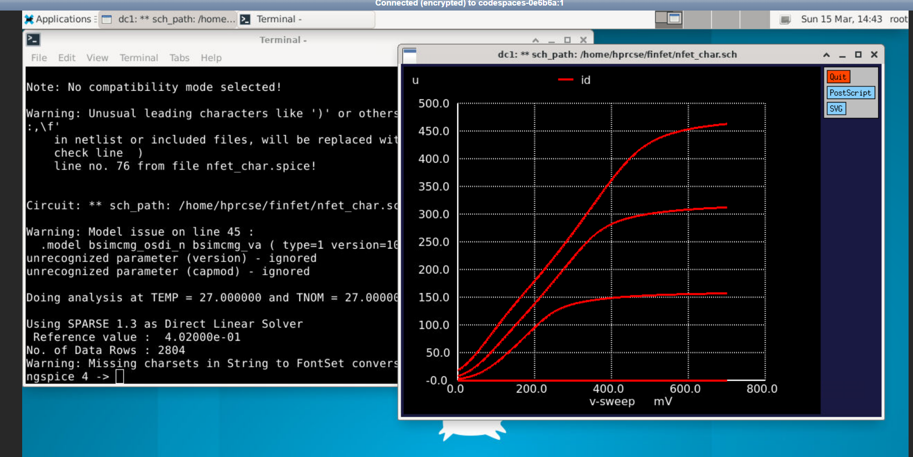
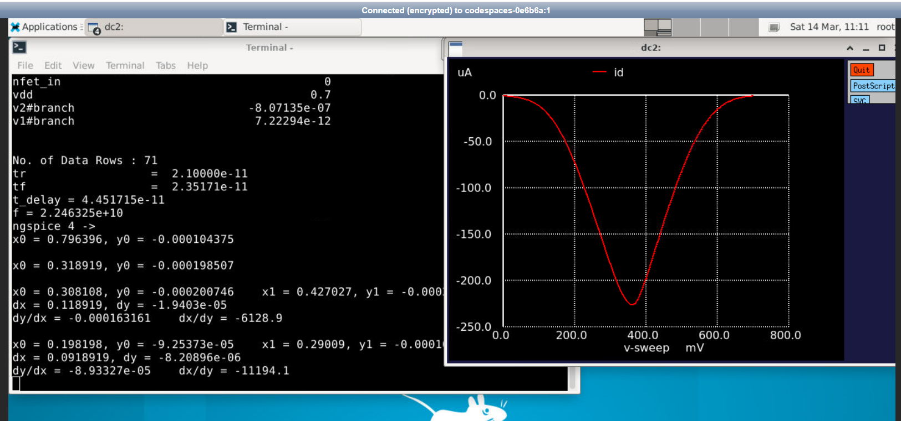
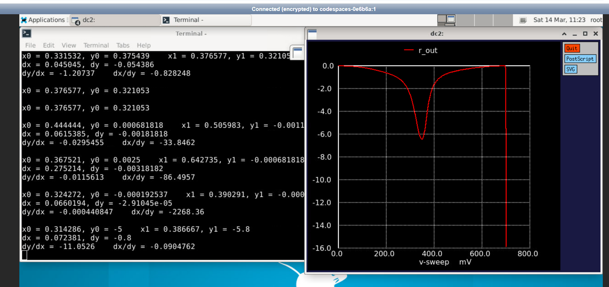
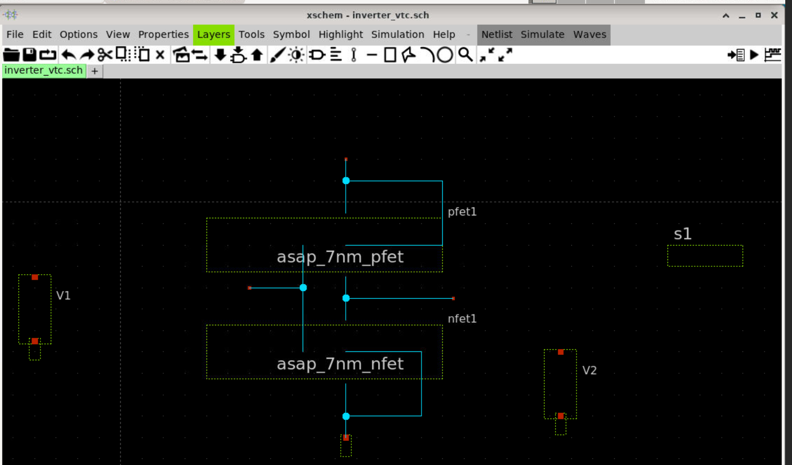
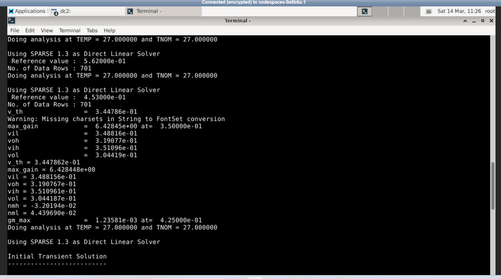
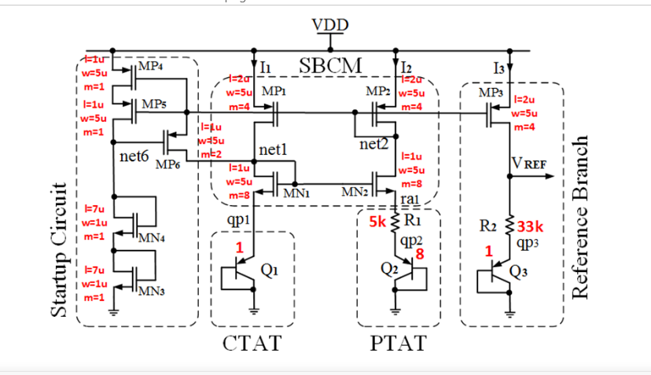
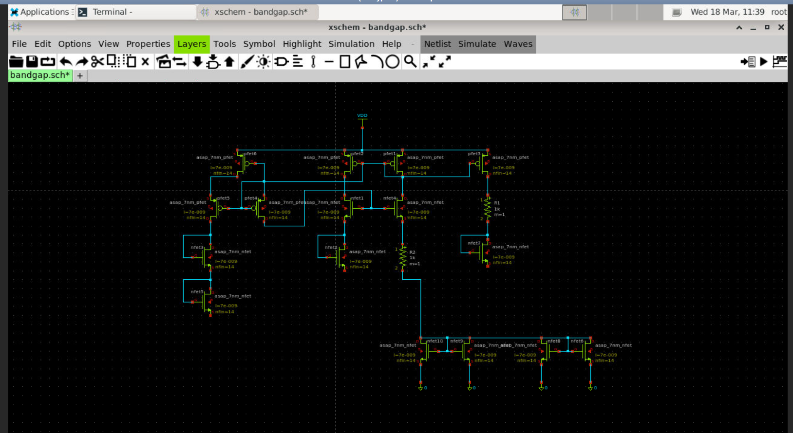
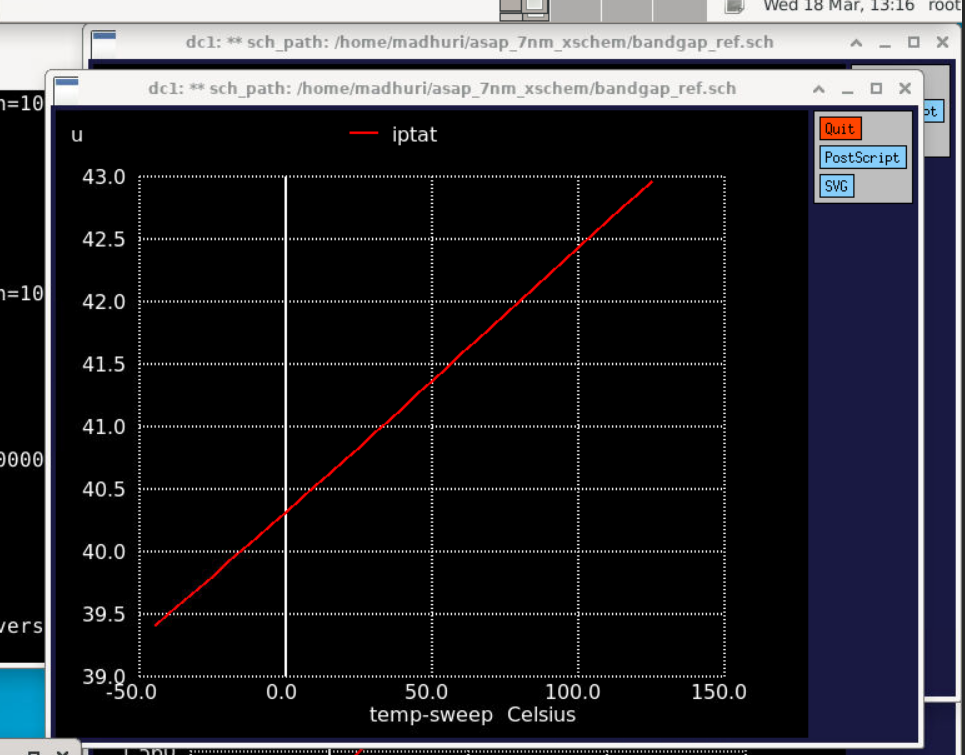

# 7nm FinFET Device and Circuit Characterization

Characterization of 7nm FinFET devices and circuits using the **ASAP7 Predictive PDK** with open-source EDA tools — Xschem and Ngspice.

**Workshop:** VSD FinFET Circuit Design and Characterization, March 2026  
**Technology:** ASAP7 7nm Predictive PDK with BSIM-CMG FinFET Models  
**Environment:** GitHub Codespaces — Ubuntu 22.04 Cloud Linux

---

## Tools Used

| Tool | Purpose |
|---|---|
| Ngspice 45+ | SPICE circuit simulation |
| Xschem 3.4.8 | Schematic capture |
| ASAP7 7nm PDK | FinFET device models BSIM-CMG |
| GitHub Codespaces | Cloud Linux environment |

---

## Part 1 — NFET Device Characterization

Characterized NFET FinFET device at 7nm using ASAP7 PDK and BSIM-CMG models. Extracted drain current, transconductance gm, and output resistance ro.

**Device:** asap_7nm_nfet | L = 7nm | nfin = 14

### NFET Testbench Schematic

### Id vs Vds — Family of Curves

### Drain Current vs Voltage

### Transconductance gm

### Output Resistance ro

### Fin Count Scaling Study

| nfin | Drive Current | gm | Vth |
|---|---|---|---|
| 14 | Baseline | Baseline | ~0.344V |
| 16 | Slight increase | Slight increase | ~0.344V |
| 28 | Higher | Higher | ~0.344V |

**Key observation:** Increasing nfin raises effective transistor width and drive current. Since NMOS and PMOS scale proportionally, the inverter switching threshold remains stable.

---

## Part 2 — FinFET Inverter Characterization

Designed and characterized 7nm FinFET CMOS inverter. Extracted VTC, switching threshold, noise margins, delay and power.

### Inverter Schematic

### Voltage Transfer Characteristic

### VTC with Extracted Parameters

### Extracted Parameters

| Parameter | Symbol | Value |
|---|---|---|
| Switching Threshold | Vth | 0.344 V |
| Maximum Gain | Av | 6.428 |
| Input Low Voltage | VIL | 0.348 V |
| Input High Voltage | VIH | 0.351 V |
| Output High Voltage | VOH | 0.319 V |
| Output Low Voltage | VOL | 0.304 V |
| Noise Margin High | NMH | -0.032 |
| Noise Margin Low | NML | 0.044 |
| Max Transconductance | gm_max | 1.235e-03 |

### Propagation Delay and Power

| Parameter | Value |
|---|---|
| Rise Delay tpr | 25 ps |
| Fall Delay tpf | 25.6 ps |
| Average Delay tp | 25.3 ps |
| Power | 2.97e-05 W |

### Terminal Output

---

## Part 3 — 7nm Bandgap Reference Circuit

Simulated Self-Cascode MOS Bandgap Reference using 7nm FinFETs. Analyzed CTAT and PTAT behavior across temperature range.

**Supply:** VDD = 1.75V  
**Temperature Range:** -45C to 125C

### Bandgap Circuit Topology

### Bandgap Schematic in Xschem

### How Bandgap Works

- Vctat decreases with temperature — CTAT behavior
- PTAT increases with temperature — PTAT behavior
- Vref remains nearly constant — stable reference output

### Vref vs Temperature

### Vctat vs Temperature

### PTAT Voltage vs Temperature

### PTAT Current vs Temperature

---

## Key Results Summary

| Parameter | Value |
|---|---|
| NFET Threshold Voltage | ~0.35 V |
| Inverter Switching Threshold | 0.344 V |
| Maximum Inverter Gain | 6.428 |
| Rise Propagation Delay | 25 ps |
| Fall Propagation Delay | 25.6 ps |
| Power Consumption | 2.97e-05 W |
| Bandgap Vref | ~1.6 V |
| Temperature Range Tested | -45C to 125C |
| Supply Voltage | 1.75 V |

---

## Skills Demonstrated

- 7nm FinFET device physics and BSIM-CMG model behavior
- DC characterization — Id-Vgs, Id-Vds, gm, output resistance
- FinFET inverter VTC, noise margins, delay and power analysis
- Bandgap reference — CTAT and PTAT compensation principle
- Temperature sweep simulation across industrial range
- Open-source VLSI toolchain: Xschem + Ngspice + ASAP7 PDK
- Linux command line, Git, GitHub workflow

---

## Acknowledgements

Base netlists and schematics sourced from VSD workshop repository:  
https://github.com/vsdip/vsd-7nm

Workshop: VSD FinFET Circuit Design and Characterization  
Instructor: Kunal Ghosh, VLSI System Design (VSD) Corp. Pvt. Ltd.  
ASAP7 PDK: Arizona State Predictive 7nm Technology  
BSIM-CMG Models: UC Berkeley Device Group  

All simulation results, graphs, analysis and documentation are my own work.
